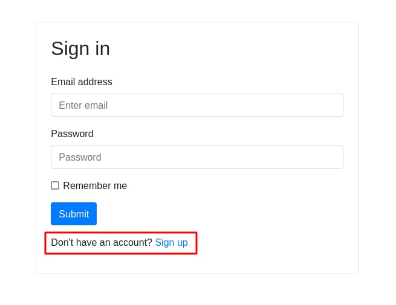
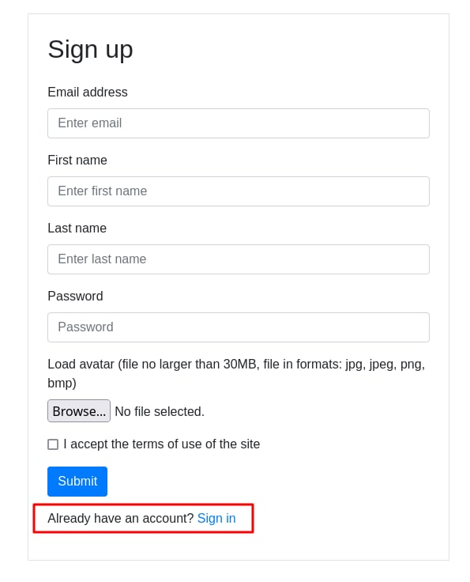
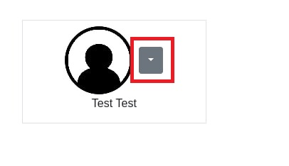

Всего в проекте есть 3 страницы: авторизация, регистрация, личный кабинет.

**Авторизация и регистрация**. 

Страницы авторизации и регистрации доступны соответственно по путям /auth/login и /auth/registration.
Если пользователь не авторизован, то он будет автоматически перенаправлен на страницу авторизации.
При необходимости регистрации можно перейти на страницу регистрации с помощью ссылки на странице авторизации, и наоборот (на скриншотах внизу эти ссылки выделены красным).
Скриншоты данных страниц представлены ниже.

**Личный кабинет**. 

Личный кабинет представлен в проекте условно: там отображается только фото пользователя с его именем. Также есть кнопка с помощью которой можно произвести logout (на скриншоте внизу выделена красным)

